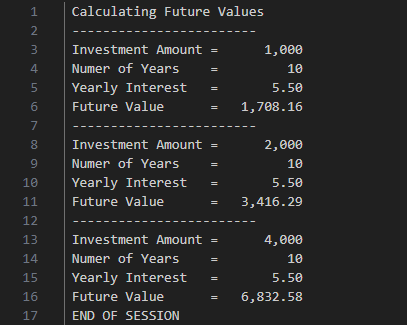
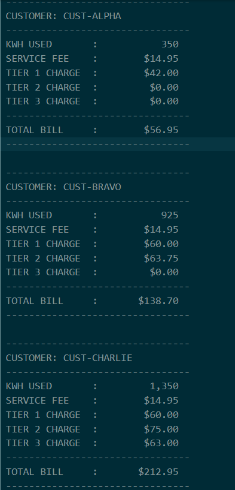
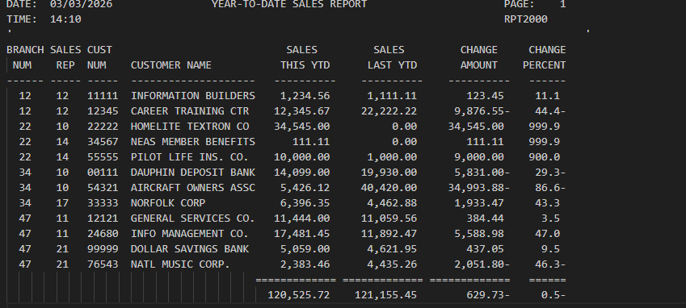
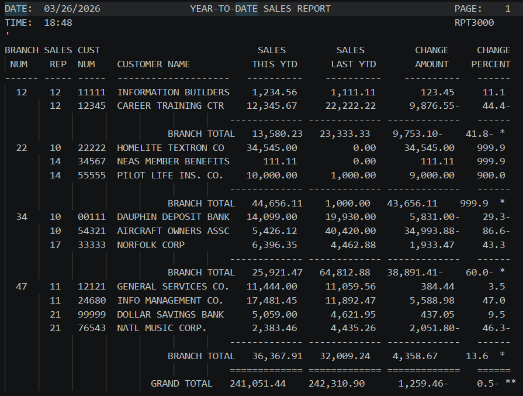
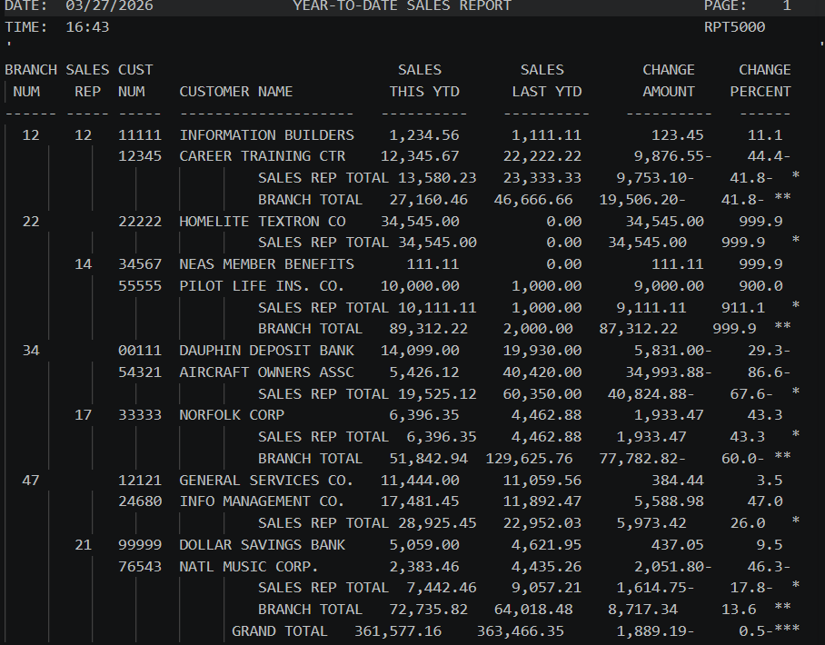
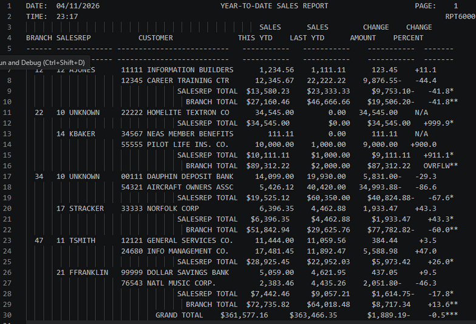

# Developer Portfolio Gateway  
**Author:** Jason Casillas  
**Course:** CIS352 – Intro to Enterprise Computing 
---

## 👋 About Me
Welcome to my GitHub portfolio repository. I’m currently studying Computer Information Systems at Wayne State College. This repository is basically a central place for all the projects and assignments I’ve worked on throughout my enterprise computing classes. Most of the projects here focus on COBOL, JCL, report generation, file processing, and working in a mainframe environment.

---

## 📸 Profile

  

<h3 align="center">Jason Casillas</h3>

  <a href="https://github.com/C0rinth1an">GitHub</a>

---

| Project Summary | Tech | Category | Description | Repo |
|---------|------|----------|-------------|------|
| [CALC2000](#calc2000) | COBOL / JCL | Enterprise Computing | Investment calculator using compound growth and doubling logic | [CALC2000](https://github.com/Pirategirl9000/CALC2000) |
| [UTIL2000](#util2000) | COBOL / JCL | Enterprise Computing | Utility billing program that calculates customer electric bills | [UTIL2000](https://github.com/C0rinth1an/UTIL2000) |
| [RPT2000](#rpt2000) | COBOL / JCL | Enterprise Computing | Creates a formatted Year-To-Date sales report | [RPT2000](https://github.com/C0rinth1an/RPT2000) |
| [RPT3000](#rpt3000) | COBOL / JCL | Enterprise Computing | Multi-page reporting system with branch totals | [RPT3000](https://github.com/C0rinth1an/RPT3000) |
| [RPT5000](#rpt5000) | COBOL / JCL | Enterprise Computing | Advanced reporting with multi-level control break logic | [RPT5000](https://github.com/C0rinth1an/RPT5000) |
| [RPT6000](#rpt6000) | COBOL / JCL | Enterprise Computing | Table processing, indexed lookups, and copybook usage | [RPT6000](https://github.com/C0rinth1an/RPT6000) |
| [SEQ3000](#seq3000) | COBOL / JCL | Enterprise Computing | Sequential employee file maintenance program | [SEQ3000](https://github.com/C0rinth1an/Section3) |

---

# CALC2000

A `COBOL` batch program that calculates future investment values and demonstrates repeated doubling logic.

### Key Concepts
Arithmetic Operations | Future Value Calculations | Output Formatting | Batch Processing

### Tech Stack

✅ Completed  
[CALC2000 Repo](https://github.com/Pirategirl9000/CALC2000)

🔙 [Back to TOC](#-table-of-contents)

---

# UTIL2000

A `COBOL` utility billing system that calculates monthly electric bills based on customer kWh usage and outputs formatted billing information.

### Key Concepts
Conditional Logic | Calculations | Multi-Record Processing | Billing Output

### Tech Stack

✅ Completed  
[UTIL2000 Repo](https://github.com/C0rinth1an/UTIL2000)

🔙 [Back to TOC](#-table-of-contents)

---

# RPT2000

A `COBOL` reporting program that processes customer records and generates a formatted Year-To-Date Sales Report with year-over-year comparisons.

### Key Concepts
COMPUTE/SUBTRACT | Percent Calculations | File Processing | Report Formatting

### Tech Stack

✅ Completed  
[RPT2000 Repo](https://github.com/C0rinth1an/RPT2000)

🔙 [Back to TOC](#-table-of-contents)

---
---

# RPT3000

A `COBOL` reporting program that creates multi-page sales reports with branch-level processing and formatted totals.

### Key Concepts
Control Break Logic | Pagination | Branch Totals | Report Layout

### Tech Stack

✅ Completed  
[RPT3000 Repo](https://github.com/C0rinth1an/RPT3000)

🔙 [Back to TOC](#-table-of-contents)

---

# RPT5000

A `COBOL` reporting system that expands reporting functionality using multi-level control breaks and more advanced decision logic.

### Key Concepts
EVALUATE | 88-Level Conditions | Two-Level Control Breaks | COMPUTE ROUNDED

### Tech Stack

✅ Completed  
[RPT5000 Repo](https://github.com/C0rinth1an/RPT5000)

🔙 [Back to TOC](#-table-of-contents)

---

# RPT6000

An advanced `COBOL` reporting project focused on table handling, indexed lookups, REDEFINES, and modular copybook usage.

### Key Concepts
REDEFINES | OCCURS | INDEXED BY | COPYLIB | Edited PIC Clauses

### Tech Stack

✅ Completed  
[RPT6000 Repo](https://github.com/C0rinth1an/RPT6000)

🔙 [Back to TOC](#-table-of-contents)

---

# SEQ3000

A `COBOL` sequential file maintenance program that processes employee master records alongside transaction records to handle adds, deletes, and updates.

### Key Concepts
Sequential File Processing | Balanced-Line Algorithm | Multi-File Processing | Error Handling

### Tech Stack

✅ Completed  
[SEQ3000 Repo](https://github.com/C0rinth1an/Section3)

🔙 [Back to TOC](#-table-of-contents)

---

## 📌 Overall Reflection
Working through these projects helped me get a much better understanding of enterprise computing and how COBOL programs are structured on a mainframe system. Across these assignments, I worked with report formatting, sequential and indexed file processing, table handling, control break logic, debugging, and JCL execution. Some projects definitely went smoother than others, but overall they helped me get more comfortable troubleshooting problems and understanding how larger COBOL programs are organized and maintained.
